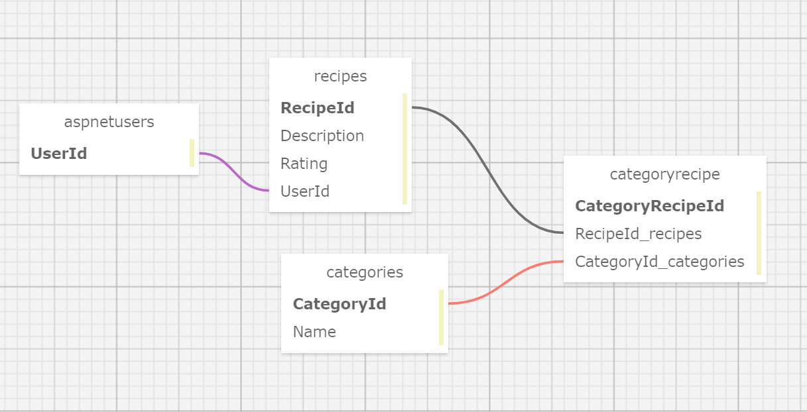

# _Recipe Box_ 

#### _Authentication with Identity Practice for Epicodus_ 
#### _DATE 01.11.2020_

#### By _**Tawnee Harris and Ellie Lambert**_

## Description

This application will allow users to create an account and login to add, view, update and delete their Recipes.

## Setup/Installation Requirements

Software Requirements
* An internet browser of your choice; I prefer Chrome
* A code editor; I prefer VSCode
* .NET Core
* MySQL
* MySQL Workbench

Open by Downloading or Cloning
* Navigate to <https://github.com/tawneeh/RecipeBox.Solution.git>
* Download this repository to your computer by clicking the green Code button and 'Download Zip'
* Or clone the repository

AppSettings
* This project requires an AppSettings file. Create your `appsettings.json` file in the main `RecipeBox` directory. 
* Format your `appsettings.json` file as follows including your unique password that was created at MySqlWorkbench installation:
```
{
  "ConnectionStrings":{
      "DefaultConnection": "Server=localhost;Port=3306;database=recipe_box;uid=root;pwd=<YourPassword>;"
  }
}
```
* Update the Server, Port, and User ID as needed.

Import Database using Entity Framework Core
* Navigate to RecipeBox.Solution/RecipeBox and type `dotnet ef migrations add <MigrationName>` into the terminal
* Then, type `dotnet ef database update` into the terminal to create your database tables.

DB SQL Schema Snippet
* Paste this Schema Create Statement into your SQL Workbench to create this database and its tables.
```
CREATE DATABASE `recipe_box` /*!40100 DEFAULT CHARACTER SET utf8mb4 COLLATE utf8mb4_0900_ai_ci */ /*!80016 DEFAULT ENCRYPTION='N' */;
USE recipe_box;
CREATE TABLE `recipes` (
  `RecipeId` int NOT NULL AUTO_INCREMENT,
  `Description` longtext,
  `UserId` varchar(255) DEFAULT NULL,
  `Rating` int NOT NULL DEFAULT '0',
  PRIMARY KEY (`RecipeId`),
  KEY `IX_Recipes_UserId` (`UserId`),
  CONSTRAINT `FK_Recipes_AspNetUsers_UserId` FOREIGN KEY (`UserId`) REFERENCES `aspnetusers` (`Id`) ON DELETE RESTRICT
) ENGINE=InnoDB AUTO_INCREMENT=12 DEFAULT CHARSET=utf8mb4 COLLATE=utf8mb4_0900_ai_ci;
CREATE TABLE `categories` (
  `CategoryId` int NOT NULL AUTO_INCREMENT,
  `Name` longtext,
  PRIMARY KEY (`CategoryId`)
) ENGINE=InnoDB AUTO_INCREMENT=6 DEFAULT CHARSET=utf8mb4 COLLATE=utf8mb4_0900_ai_ci;
CREATE TABLE `categoryrecipe` (
  `CategoryRecipeId` int NOT NULL AUTO_INCREMENT,
  `RecipeId` int NOT NULL,
  `CategoryId` int NOT NULL,
  PRIMARY KEY (`CategoryRecipeId`),
  KEY `IX_CategoryRecipe_CategoryId` (`CategoryId`),
  KEY `IX_CategoryRecipe_RecipeId` (`RecipeId`),
  CONSTRAINT `FK_CategoryRecipe_Categories_CategoryId` FOREIGN KEY (`CategoryId`) REFERENCES `categories` (`CategoryId`) ON DELETE CASCADE,
  CONSTRAINT `FK_CategoryRecipe_Recipes_RecipeId` FOREIGN KEY (`RecipeId`) REFERENCES `recipes` (`RecipeId`) ON DELETE CASCADE
) ENGINE=InnoDB AUTO_INCREMENT=23 DEFAULT CHARSET=utf8mb4 COLLATE=utf8mb4_0900_ai_ci;CREATE TABLE `__efmigrationshistory` (
  `MigrationId` varchar(95) NOT NULL,
  `ProductVersion` varchar(32) NOT NULL,
  PRIMARY KEY (`MigrationId`)
) ENGINE=InnoDB DEFAULT CHARSET=utf8mb4 COLLATE=utf8mb4_0900_ai_ci;
```

SQL Database Design
<center>

</center>

Launch this Application
* Navigate to RecipeBox.Solution/RecipeBox and type `dotnet restore` into the terminal
* Then, in the same project folder, type `dotnet build` into the terminal followed by `dotnet run`
* Peruse this application at your leisure

## Known Bugs

This application has no known bugs. 

## Support and contact details

Please feel free to reach out to Tawnee anytime at <tawneeh@icloud.com>

Co-authored-by: Ellie Lambert <ebezjian@gmail.com>

## Technologies Used

* C#
* Razor
* Entity Framework Core
* MySql
* MySql Workbench
* Identity

### License

[](https://opensource.org/licenses/MIT)

Copyright (c) 2020 **_Tawnee Harris and Ellie Lambert_**